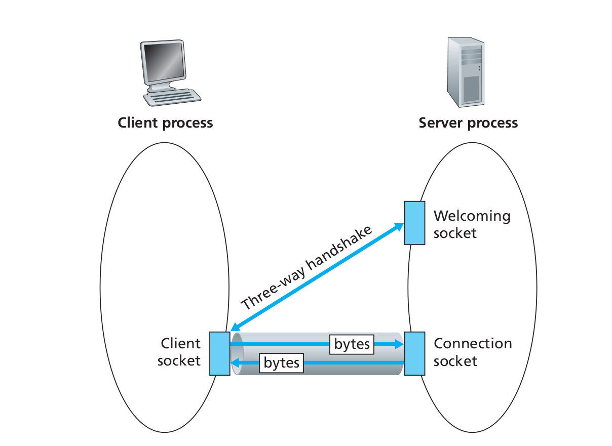
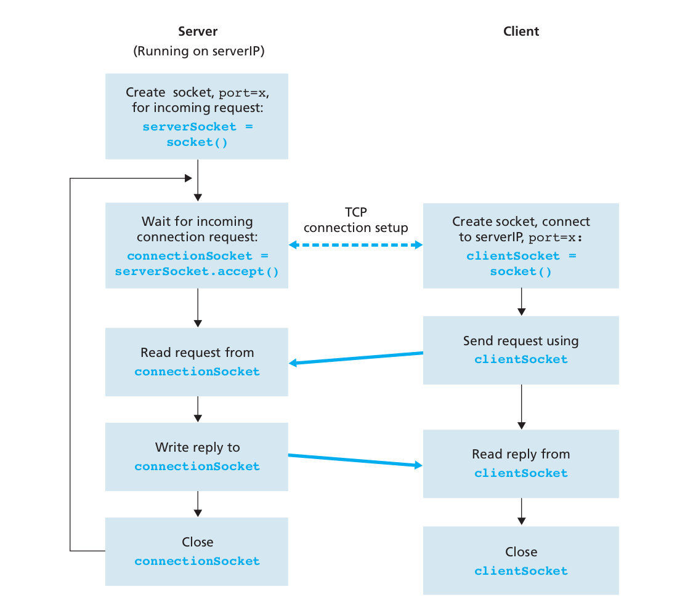

<h1>Socket Programming With TCP</h1>

Unlike UDP, TCP is a connection-oriented protocol. This means that before the client
and server can start to send data to each other, they first need to handshake and estab-
lish a TCP connection. One end of the TCP connection is attached to the client socket
and the other end is attached to a server socket. When creating the TCP connection,
we associate with it the client socket address (IP address and port number) and the
server socket address (IP address and port number). With the TCP connection estab-
lished, when one side wants to send data to the other side, it just drops the data into
the TCP connection via its socket. This is different from UDP, for which the server
must attach a destination address to the packet before dropping it into the socket.
 
The client has the job of initiating contact with the server. In order for the
server to be able to react to the client’s initial contact, the server has to be ready.
This implies two things. First, as in the case of UDP, the TCP server must be run-
ning as a process before the client attempts to initiate contact. Second, the server
program must have a special door—more precisely, a special socket—that wel-
comes some initial contact from a client process running on an arbitrary host. Using
our house/door analogy for a process/socket, we will sometimes refer to the client’s
initial contact as “knocking on the welcoming door.”
 
With the server process running, the client process can initiate a TCP connec-
tion to the server. This is done in the client program by creating a TCP socket. When
the client creates its TCP socket, it specifies the address of the welcoming socket in
the server, namely, the IP address of the server host and the port number of the
socket. After creating its socket, the client initiates a three-way handshake and
establishes a TCP connection with the server. The three-way handshake, which takes
place within the transport layer, is completely invisible to the client and server pro-
grams.
 
During the three-way handshake, the client process knocks on the welcoming door
of the server process. When the server “hears” the knocking, it creates a new door—
more precisely, a new socket that is dedicated to that particular client. In our example
below, the welcoming door is a TCP socket object that we call serverSocket; the
newly created socket dedicated to the client making the connection is called connec-
tionSocket.
 
<b>From the application’s perspective, the client’s socket and the server’s connec-
tion socket are directly connected by a pipe.</b> 

The client process can send arbitrary bytes into its socket, and TCP guarantees that the server
process will receive (through the connection socket) each byte in the order sent. TCP
thus provides a reliable service between the client and server processes. Furthermore,
just as people can go in and out the same door, the client process not only sends bytes
into but also receives bytes from its socket; similarly, the server process not only
receives bytes from but also sends bytes into its connection socket.
We use the same simple client-server application to demonstrate socket program-
ming with TCP: The client sends one line of data to the server, the server capitalizes
the line and sends it back to the client.

